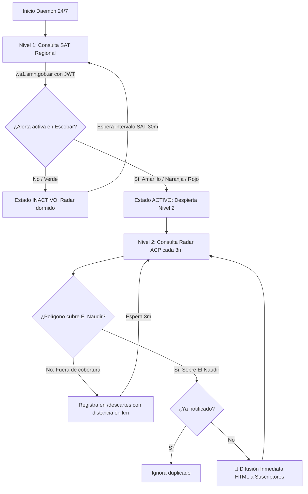

# NaudirEarlyAlert 🌩️🤖

> Daemon autónomo 24/7 y Bot de Telegram para detección temprana y alerta inmediata de tormentas severas y avisos a muy corto plazo (ACP) del Servicio Meteorológico Nacional (SMN) argentino para el **Barrio El Naudir – Aguas Privadas** (Belén de Escobar, Buenos Aires).

---

## 📍 Coordenadas y Zona de Monitoreo

- **Ubicación:** Barrio El Naudir – Aguas Privadas (Escobar, Bs. As.)
- **Latitud:** `-34.3100`
- **Longitud:** `-58.7391`
- **Zona Administrativa SAT:** `"Escobar"`
- **SMN Location ID:** `4816` (Parque El Cazador / Escobar)

---

## ⚙️ Arquitectura del Sistema (2-Tier State Machine)

El daemon optimiza el consumo de ancho de banda y cuotas de API mediante un flujo inteligente de dos niveles:



1. **Nivel 1 – Alertas Regionales (SAT):**
   - Consulta el endpoint oficial de geolocalización `ws1.smn.gob.ar/warning/alert/location/4816` (con fallback a feed abierto).
   - Analiza si el partido de **Escobar** se encuentra bajo alerta meteorológica (amarillo, naranja o rojo).
   - Si no hay alertas activas, el monitoreo por radar se mantiene **dormido** para evitar tráfico innecesario.
   - Si se detecta alerta activa en la zona, el estado pasa a **ACTIVO** y despierta inmediatamente el Nivel 2.

2. **Nivel 2 – Avisos a Muy Corto Plazo por Radar (ACP):**
   - Cuando el estado SAT está activo, consulta `ws1.smn.gob.ar/warning/shortterm/` cada **3 a 5 minutos**.
   - **Geometría Espacial (Shapely):** Parsea el polígono exacto de la celda de tormenta y evalúa si las coordenadas de El Naudir se encuentran **dentro** (`Polygon.contains(Point)`).
   - **Deduplicación Persistente:** Registra los IDs de celdas ya notificadas en memoria y SQLite para no repetir alertas del mismo evento.
   - **Difusión Inmediata:** Si una tormenta intersecta El Naudir, emite la alerta con formato HTML a todos los usuarios suscritos vía Telegram.
   - **Bypass de Cloudflare:** Utiliza renovación automática de Token JWT vía proxy (Scrape.do) cada 1 hora (~720 requests/mes, dentro de la cuota gratuita de 1.000).

---

## 📱 Comandos del Bot en Telegram

| Comando | Descripción |
| :--- | :--- |
| `/start` | Suscribe al usuario para recibir alertas de tormentas en El Naudir. |
| `/stop` | Cancela la suscripción y elimina al usuario de la lista de difusión. |
| `/estado` | Muestra el estado del daemon, alerta SAT actual, modo de radar y suscriptores. |
| `/descartes` | Lista tormentas vigentes en la región descartadas por estar fuera de cobertura (con distancia en km). |
| `/prueba` | Envía una alerta de simulación realista **únicamente a tu chat** (no notifica a los demás). |
| `/help` | Muestra la ayuda y lista de comandos disponibles. |

### Formato de Alerta Difundida
```html
⚠️ ALERTA METEOROLÓGICA (ACP) ⚠️

⚡ Fenómeno: TORMENTAS FUERTES CON LLUVIAS INTENSAS Y OCASIONAL CAIDA DE GRANIZO
🟠 Severidad: Naranja (Tormentas fuertes / severas)
⏱️ Emisión: 07:38 hs
⏳ Vigencia: Hasta las 09:38 hs (2 horas de validez)

Zonas bajo aviso:
• BUENOS AIRES: Escobar - Campana - Pilar - Tigre.

📍 Tormenta severa detectada sobre nuestras coordenadas (El Naudir).

📡 Ver radar en vivo (animación oficial)
🛰️ Ver satélite GOES-16 (Topes nubosos)
🌐 Ver Avisos a Muy Corto Plazo en SMN
```

---

## 🌎 ¿Cómo adaptarlo para cualquier otra localidad o barrio en Argentina?

Este sistema es **100% modular y configurable**. No requiere modificar el código Python para funcionar en cualquier otro punto del país (barrios cerrados, campos agrícolas, clubes, municipios o ciudades).

Solo necesitas configurar 3 variables en tu archivo `.env`:

### 1. Obtener Coordenadas GPS (Latitud y Longitud)
1. Abrí [Google Maps](https://maps.google.com).
2. Hacé clic derecho sobre la ubicación exacta de tu barrio o casa.
3. Copiá el primer número (Latitud) y el segundo (Longitud).
   * *Ejemplo:* `-34.3100, -58.7391`

### 2. Identificar la Zona Administrativa del SMN
Es el nombre del **Partido o Departamento** oficial según las alertas del SMN:
* *Ejemplos comunes:* `Escobar`, `Pilar`, `Tigre`, `San Isidro`, `La Plata`, `Rosario`, `Córdoba`, `Mar del Plata`.
* *Auto-Resolución de ID:* El cliente consulta automáticamente la API de georeferencia del SMN (`georef/location/coord`) con tus coordenadas para obtener el ID de estación oficial más cercana (ej: `4816`).

### 3. Configurar tu `.env`

Editá tu `.env` con los datos de tu nueva localidad:

```ini
# Nombre que aparecerá en los mensajes de Telegram
LOCATION_NAME=Barrio Los Alisos

# Coordenadas exactas del polígono/casa
ALERT_LAT=-34.4215
ALERT_LON=-58.6480

# Partido / Departamento oficial
ALERT_ZONE=Tigre
```

---

## 🚀 Despliegue y Mantenimiento en Servidor (GCP / Ubuntu)

### 1. Requisitos Previos
* Python 3.10+
* Virtualenv (`python3-venv`)
* Token de Telegram obtenido en `@BotFather`
* Token opcional de Scrape.do para auto-renovación de JWT (1.000 requests/mes gratis)

### 2. Configurar Variables de Entorno (`.env`)
Creá tu archivo `.env` a partir de la plantilla y completá tus variables:
```bash
cp .env.example .env
nano .env
```
*(Completá tu `TELEGRAM_BOT_TOKEN`, coordenadas y zona según la sección anterior).*

### 3. Servicio Autónomo 24/7 (`systemd`)
El bot se administra mediante un servicio de usuario de `systemd` que sobrevive a cierres de sesión SSH y reinicios de la máquina virtual gracias a `linger`:

```bash
# Habilitar persistencia de usuario (se ejecuta una sola vez como root/ubuntu)
sudo loginctl enable-linger $USER

# Iniciar o reiniciar el servicio
systemctl --user restart smn-bot

# Ver logs en vivo
journalctl --user -u smn-bot -f

# Ver estado
systemctl --user status smn-bot
```

### 4. Actualización Rápida de Versión
Para aplicar actualizaciones subidas al repositorio:
```bash
cd ~/NaudirEarlyAlert && git pull && systemctl --user restart smn-bot
```

---

## 🧪 Pruebas Automatizadas

El proyecto cuenta con una suite completa de tests unitarios:
- Verificación geométrica de polígonos GeoJSON / coordenadas SMN (`shapely`).
- Deduplicación de avisos y persistencia en SQLite.
- Cálculo de duración y formato de mensajes HTML.
- Filtrado y descarte de tormentas lejanas.

Ejecutar tests:
```bash
python -m unittest discover tests/
```

---

## 📄 Licencia

Desarrollado para la comunidad de **El Naudir – Aguas Privadas**.
Distribuido bajo licencia MIT.
